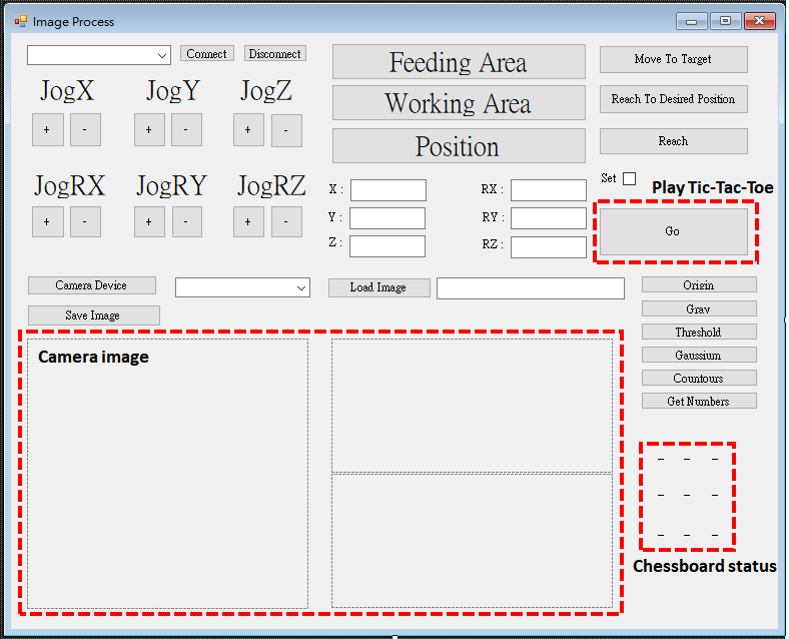
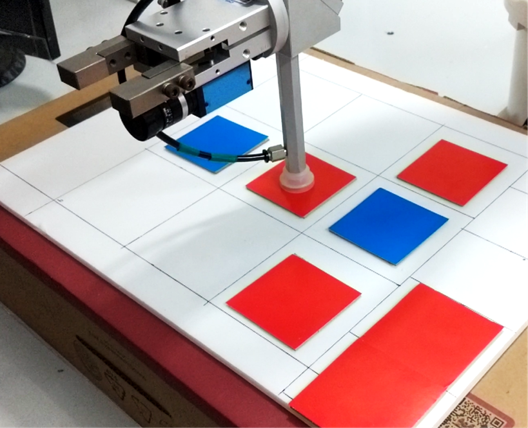

# Play Tic tac toe With Manipulator
Play tic-tac-toe game with ABB robotic arm.

## Overview

This project implements play tic-tac-toe game with ABB IRB 120 robotic arm.  
We complete this project together in ARAA course.

  

## Reference

[1] Thank [Chien-Yu Lin](https://github.com/cy20lin) for Tic-Tac-Toe algorithm.  
[2] Thank [NTUT ISL Lab TA](http://www.isl.ee.ntut.edu.tw/) for manipulator API and introduction.
